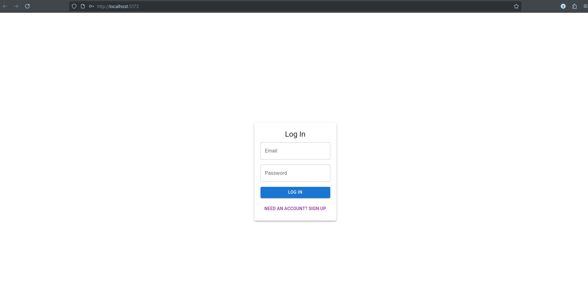
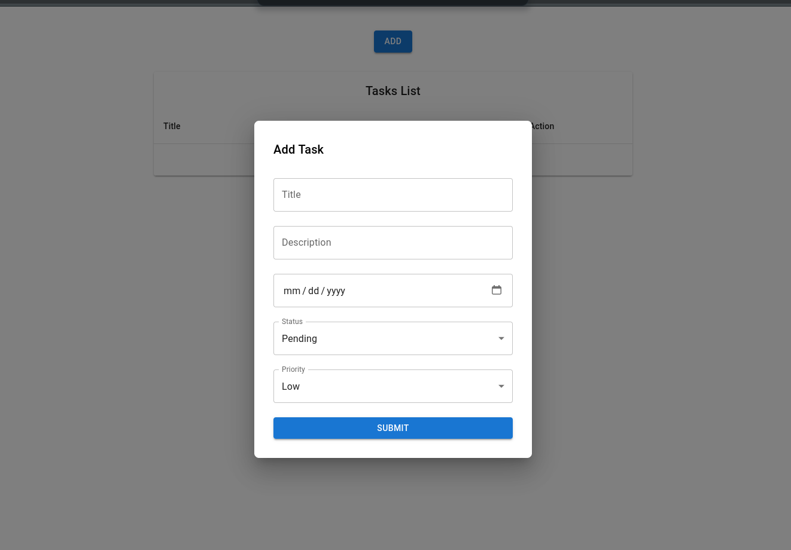

# Todo Application

A simple todo list application built with [your tech stack—add details here].
To run you have to connect mongodv compass locally with this project

## Features

- Add, update, delete tasks
- Mark tasks as completed
- User authentication
- Responsive UI

screenshots
Login


Task Add page


## Installation

1. Clone the repo
   ```bash
   git clone https://github.com/Sultanomar0013/todo_application.git
   ```
